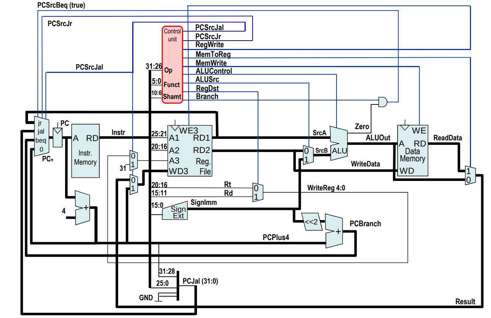
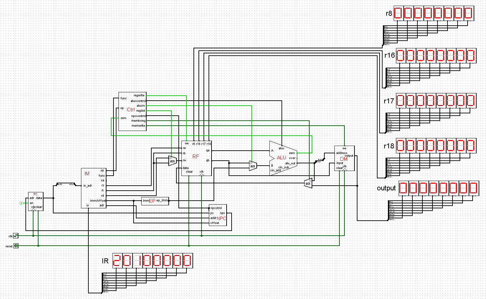

# Single Cycle CPU

A single cycle cpu executes each instruction in one cycle. In other words, one cycle is needed to execute any instruction.

Each cycle requires some constant amount of time. this means we will spend the same amount of time to execute every instruction [one cycle], regardless of how complex our instructions may be. To ensure that our processor operates correctly, our slowest instruction must be able to complete execution correctly in one clock tick. This is the big disadvantage of single cycle cpu's: the machine must operate at the speed of the slowest instruction. The big advantage of single cycle cpu's is that they are easy to implement.



## The Circuit



## Test
Use the following code to test, the result is `2d`.
```asm
00000000：(20100000)         addi $16,$0,0
00000004：(20110000)         addi $17,$0,0
00000008：(00009024)         and $18,$0,$0
0000000C：(2008000a)         addi $8,$0,10
00000010：(12280004) label1: beq $17,$8,label2
00000014：(02129020          add $18,$16,$18
00000018：(22100001)         addi $16,$16,1
0000001C：(22310001)         addi $17,$17,1
00000020：(08000004)         j labl1
00000024：(ac120040) label2: sw $18,0x00000040($0)
00000028：(8c100040)         lw $16,0x00000040($0)
```

## Pro
See [single-cycle-cpu-pro.circ](single-cycle-cpu-pro.circ).